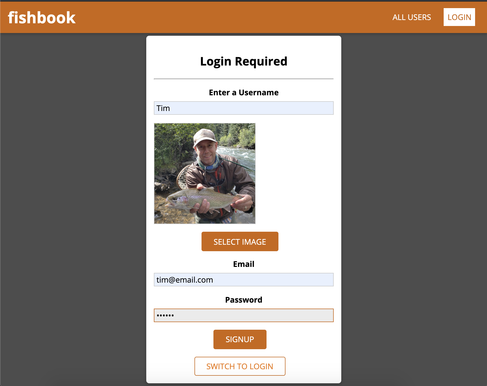

# fishbook
The frontend code for a MERN stack application for logging and referencing your fly-fishing trips.

* Frontend validation
* Google Maps API
* Google Geocoding API
* dotenv to secure API keys
* momentjs to format dates retrieved form MongoDB

# Visulas
## Landing Page
Nav options are limited as you are not logged on.

## Sign Up
Click LOGIN and select Switch to Signup to see the sign up form.
* All fields are validated and required
* The email address must be unique or sign up fails
* Passwords are stored encrypted using json web tokens

## Sign In
Click LOGIN and enter email and password

## New Trip Form
Click NEW TRIP to enter trip details.
* Fields are validated

## Trip Cards
* Trip cards are visible if you are not logged in
* If not logged in then details are not displayed on the card
* If you are logged on then you can see trip details
* Users can edit trip cards for trips they created
* Use View on Map to see a Google map of the location

# Futures
* movable geocoding pin to pinpoint specific spots to referenece again later
* Use social media for authentication instead of managing users and passwords
* Search trips by date or location
* Ability to upload more pictures and add them to a carousel
* Store uploaded photos on Amazon S3
* DB backups

#### GitHub Repo
[fishbook2020](https://github.com/eric-gustafson1/fishbook)

#### Firebase hosting for the frontend
[fishbook2020](https://fishbook2020.firebaseapp.com/)

